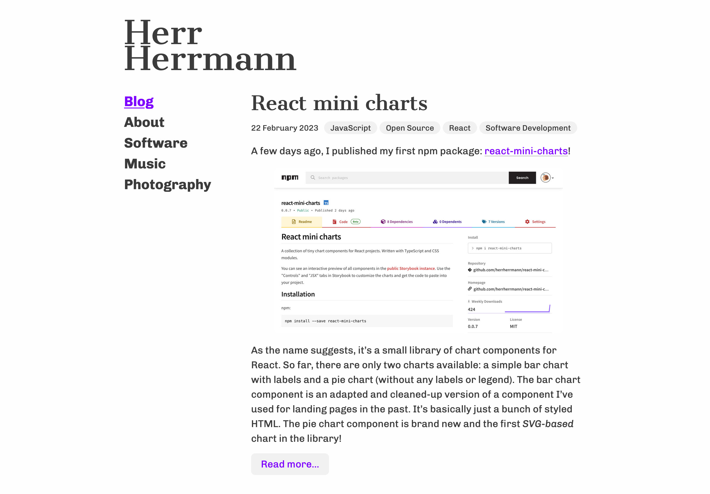

# Silver Ratio

A responsive and simple, pretty much minimalist, theme for WordPress.

## Features

- Two-column layout
- Two menus: Sidebar and footer
- Automatic dark mode (based on CSS media query)
- Self-hosted fonts (no Google Fonts)

## Screenshot



## Development

```bash
# Install dependencies
npm install
# Build styles and watch all *.less files for changes
npm start
```
